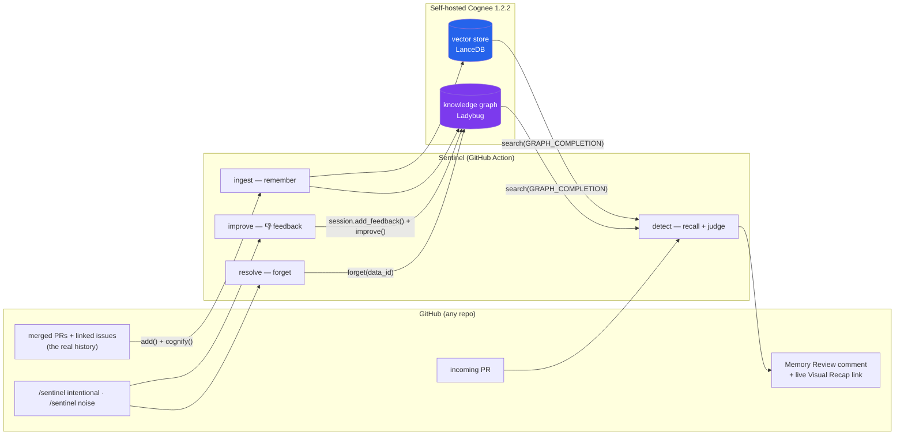

# 🛡️ Sentinel — the Memory OS for software engineering

**A GitHub Action that catches when a PR silently reverses a past engineering decision — and tells you *why* that decision was made.** Built on [Cognee](https://www.cognee.ai/)'s knowledge-graph memory: the full lifecycle — `remember` · `recall` · `improve` · `forget` — running live on real pull requests.

> Other bots review your code against the internet's conventions. **Sentinel reviews it against yours** — reconstructed from your own PRs and issues, no docs required.

## 🔴 See it running live, right now

Everything below is on a public repo, generated by the Action — click through:

| What | Where |
|------|-------|
| 🧠 **The catch** — a "simplify checkout" PR that silently re-reverses an async-email decision; Sentinel reconstructs the Black Friday incident behind it | [sentinel-test-repo PR #22](https://github.com/QueenHubLarping/sentinel-test-repo/pull/22) |
| 📊 **Visual Memory Recap** — interactive page per flag: the diff annotated against memory, the belief card, the traversable evidence graph | linked from every flagged PR's comment |
| 🎯 **The full test matrix** — 12 open PRs: 8 real reversals (auth, payments, infra, search, webhooks, messaging) + 4 noise controls | [all open PRs](https://github.com/QueenHubLarping/sentinel-test-repo/pulls) |
| 📈 **Precision report** — every PR graded against ground truth | [`STRESS_REPORT.md`](STRESS_REPORT.md) |
| 🕸️ **The memory** — 8 incident issues + 8 merged decision PRs the graph was built from | [issues](https://github.com/QueenHubLarping/sentinel-test-repo/issues?q=is%3Aissue) · [merged PRs](https://github.com/QueenHubLarping/sentinel-test-repo/pulls?q=is%3Apr+is%3Amerged) |

**The score, on real GitHub Action runs: 12 PRs reviewed → 8/8 genuine reversals flagged with the correct decision + incident cited · 4/4 noise PRs (typo, dep bump, bugfix, tuning) correctly silent · 0 false positives.**

## The problem

Codebases remember *what* changed, never *why*. `git blame` gives you an author and a line — never the incident, the tradeoff, or the 3am decision behind it. Months later someone opens a PR to "simplify" something — and unknowingly undoes a deliberate decision the team made for a reason nobody remembers. Sentinel is the institutional memory that catches it.

## How it works — the four Cognee verbs, all real

1. **remember** — ingest the repo's own history (merged PRs + linked incident issues, via the GitHub API) into a Cognee knowledge graph. `cognify` extracts typed cross-document edges. No ADRs, no docs tax — deployable on any repo.
2. **recall** — on each PR, multi-hop traversal finds the decision the change contradicts *and its rationale*: `incoming PR → governing Decision → incident Issue`. The hop is recoverable **neither by vector similarity (no shared words) nor by following a `#ref` (none exists)** — only typed graph edges + semantic recall together reconstruct it.
3. **comment** — the **Memory Review** card: *what this PR changes · why it matters · what your organization currently believes · memory impact*, with confidence and a trust tier (human-approved beliefs drive confident flags; machine-inferred ones only propose). Advisory — never blocks a merge.
4. **show** — every flag ships a **Visual Memory Recap**: a live interactive page (linked in the comment) with the diff annotated against memory, the belief card, and the evidence graph — including a "play the traversal" animation that walks the multi-hop recall on screen.
5. **forget** — reply `/sentinel intentional` and Sentinel retires the superseded decision via `cognee.forget()`: the graph mutates, and **the same PR re-runs silent**. Memory that updates the moment the team makes a new call.
6. **improve** — reply `/sentinel noise` and the 👎 flows through `cognee.improve()`, down-weighting the exact graph elements that produced the flag; that drift type stops surfacing. Nothing is deleted — the ranking learns.

**The one-sentence test:** remove Cognee and Sentinel breaks — a learning is a relationship between distant, differently-worded events (an incident, a decision, an outcome) that share no words and no links; only typed graph traversal + semantic recall together can reconstruct it.

## Architecture



## How Cognee is used — API by API (for judges grepping for depth)

| Cognee API | Where | Why it's load-bearing |
|---|---|---|
| `cognee.add(DataItem(data_id=uuid5(...)))` + `cognee.cognify()` | [`sentinel/ingest.py`](sentinel/ingest.py) | **Stable, deterministic data_ids** per PR/issue doc — what makes *selective forget* possible across ephemeral CI runners. `cognify` extracts the typed cross-document edges the multi-hop catch depends on. |
| `cognee.search(query_type=GRAPH_COMPLETION)` (+ `only_context=True`) | [`sentinel/detect.py`](sentinel/detect.py) | The hybrid recall: vector match finds the semantic neighborhood, graph traversal reaches the rationale **across documents that share no words and no links**. The raw-context probe is the honest before/after measure for the forget flip. |
| `cognee.search(session_id=…, feedback_influence>0, top_k=…)` | [`sentinel/detect.py`](sentinel/detect.py) | Detection runs inside a Cognee **session** so the exact `used_graph_element_ids` behind a flag are recorded — feedback lands on the evidence that produced it. |
| `cognee.forget(data_id=…, dataset=…)` | [`sentinel/resolve.py`](sentinel/resolve.py) | `/sentinel intentional` retires the establishing-PR doc **and its rationale issue** from active memory (history stays on GitHub). The same PR re-runs silent — a real graph mutation, visible as a behavior flip. |
| `cognee.session.add_feedback(score=…)` → `cognee.improve(feedback_alpha=0.3)` | [`sentinel/improve.py`](sentinel/improve.py) | A maintainer 👎 nudges `feedback_weight` on the flag's own graph elements (gentle re-rank, not an erase) — Cognee's critic-guided reweighting used exactly as designed. |
| Trust tiers via feedback weights | [`sentinel/trust.py`](sentinel/trust.py) | Human-approved beliefs drive confident flags; machine-inferred ones only *propose* — approval is the strongest positive feedback signal. |

## What Sentinel catches — and what it doesn't

Honest scope, so you know exactly what you're getting:

- **It catches decision reversals, not bad code.** Sentinel is not a linter or a general review bot — it flags a PR only when the change contradicts a decision reconstructable from your merged-PR + issue history. Everything else stays silent by design.
- **The rationale must exist somewhere in history.** Sentinel *connects* evidence (a merged PR, its linked incident issue, review discussion) — it never invents a "why" that was written nowhere. No recorded rationale → no confident flag. This guardrail is why the noise controls stay silent.
- **The judge is an LLM, bounded by recall.** A decision absent from the graph can't be cited; subtle reversals can slip through (false negatives are possible). That's why flags carry a confidence score and a trust tier — human-approved beliefs drive confident flags, machine-inferred ones only propose — and why Sentinel is **advisory-only: it never blocks a merge**.
- **Memory is per-repo and rebuilt from the snapshot each run** — no cross-repo memory, no incremental ingest yet (see the roadmap below).

## Run it on your repo

```yaml
# .github/workflows/sentinel.yml
name: Sentinel
on:
  pull_request:
    types: [opened, synchronize, reopened]
  issue_comment:
    types: [created]
permissions:
  pull-requests: write
  issues: write
  contents: write
jobs:
  sentinel:
    runs-on: ubuntu-latest
    steps:
      - uses: actions/checkout@v4
      - uses: QueenHubLarping/sentinel-hq@main
        with:
          mode: post
          llm-provider: openai            # or self-host: ollama (see below)
          llm-model: gpt-4o-mini
          llm-endpoint: ""
          llm-api-key: ${{ secrets.OPENAI_API_KEY }}
          embedding-provider: openai
          embedding-model: text-embedding-3-small
          embedding-dimensions: "1536"
          embedding-api-key: ${{ secrets.OPENAI_API_KEY }}
```

Two LLM postures, same self-hosted Cognee memory (graph = Ladybug, vector = LanceDB, relational = SQLite — all local files):

- **GitHub-hosted runner** (zero infra): OpenAI `gpt-4o-mini` + `text-embedding-3-small` — the config above, and what the live demo repo runs.
- **Fully self-hosted** (nothing leaves your box): local Ollama for both reasoning (`qwen2.5:3b`) and embeddings (`nomic-embed-text`), or Groq (`llama-3.3-70b-versatile`) for reasoning with local embeddings — the Action's defaults; see [`action.yml`](action.yml).

## Local development

```bash
python3.12 -m venv .venv && source .venv/bin/activate   # 3.10–3.12
pip install -r requirements.txt
cp .env.template .env                                    # set GROQ_API_KEY (or OpenAI env)

python scripts/day2_detect.py    # single-PR reversal detection (graph auto-ingested)
python scripts/day3_flip.py      # flag → /sentinel intentional → same PR silent (+ graph HTMLs)
python scripts/day4_improve.py   # 👎 → cognee.improve() → similar flag suppressed
python scripts/recap_demo.py     # Visual Memory Recap preview (offline, no LLM)
python scripts/stress_test.py    # the full precision matrix → STRESS_REPORT.md

pip install pytest && pytest tests/   # 66 pure-function tests, no network
```

## Repo map

```
sentinel/    detect (recall+judge) · comment (Memory Review) · recap (Visual Memory Recap)
             ingest (remember) · resolve (forget) · improve · trust (belief tiers)
             sources (GitHub API ingestion) · graph_viz (evidence Mermaid) · connection
scripts/     action_entrypoint (the Action) · seed_demo_repo (create demo data via the API)
             stress_test (precision matrix) · day2–day4 demos · recap_demo
.sentinel/   api_snapshot.json (offline replay of API responses) · approved.json (trust tier)
             retired.json (durable forget ledger)
```

## Team & disclosure

Built by **Chayan, Rudradeep, Abhijit** for the Cognee "Hangover Part AI" hackathon (Jun 29 – Jul 5, 2026), track: **Best Use of Open Source** (self-hosted Cognee 1.2.2).

_Built with assistance from Claude (Claude Code) — disclosed per hackathon rules. Demo data on the test repo is seeded **input** history (created via the GitHub API); every Sentinel output — comments, recaps, graph mutations, behavior flips — is generated live by the Action._
